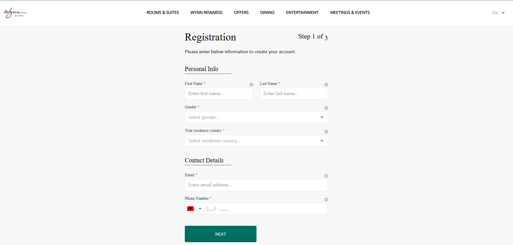
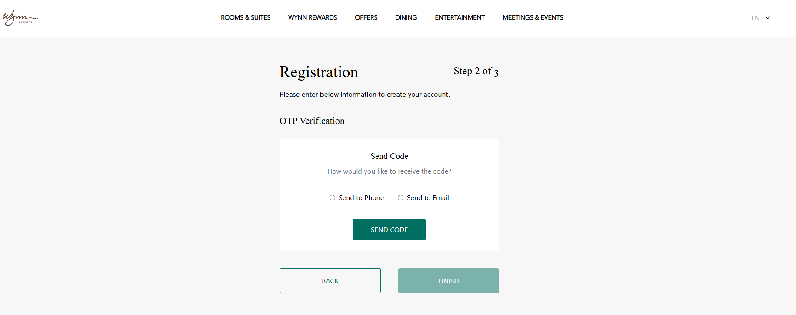
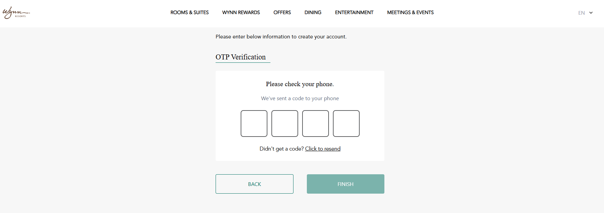

# 🚀Wynn Resort Multi-Step Registration Form

A responsive, accessible multi-step registration form built with **React**. It includes custom input components, country code selector with flags, OTP input, and form validation using **Zod**.

---

## ✨ Features

- Multi-step registration flow
- Custom reusable input components
- Phone input with country code dropdown and flag
- 4-digit OTP input with auto-focus
- Real-time form validation using Zod
- Tailwind CSS for design and responsiveness

---

## 📦 Tech Stack & Dependencies

| Package             | Purpose                                                   |
|---------------------|-----------------------------------------------------------|
| **React**           | Core UI library                                            |
| **Zod**             | Type-safe schema validation                                |
| **Tailwind CSS**    | Utility-first CSS framework                                |
| **react-imask**     | Input masking for phone numbers                            |
| **React Router**    | Navigation between steps (optional)                        |
| **tailwind-merge**  | Utility function to merge Tailwind CSS classes             |

> See [`package.json`](./package.json) for the full dependency list.

---

## 🖼️ Screenshots

### Step 1 – Personal Information



---

### Step 2 – Phone Verification



---

### OTP Input



---

## 🛠️ Installation

Make sure you have **Node.js (v16 or later)** and **npm** or **Yarn** installed.

### 1. Clone the Repository

```bash
git clone https://github.com/aldiposhnjari92/wynn-resort
cd wynn-resort
npm install --force
```

### 2. Install the App

```bash
npm install --force
```

or if you are using yarn
```bash
yarn install
```

### 3. Run the App
```bash
npm run dev
```